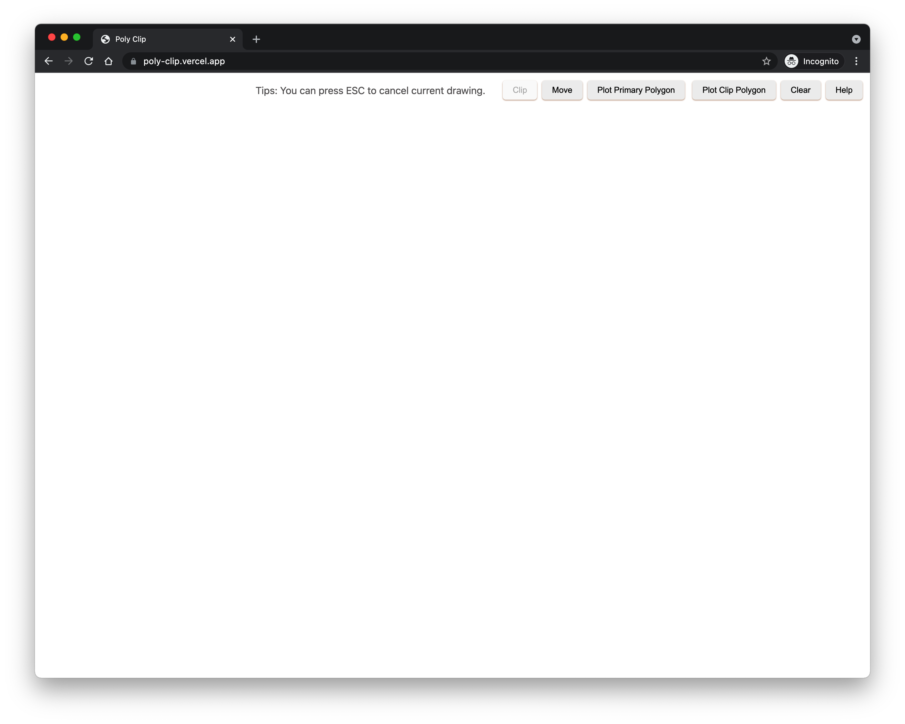
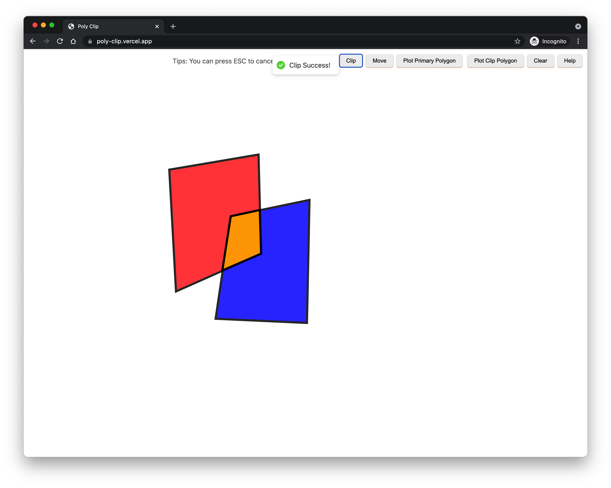
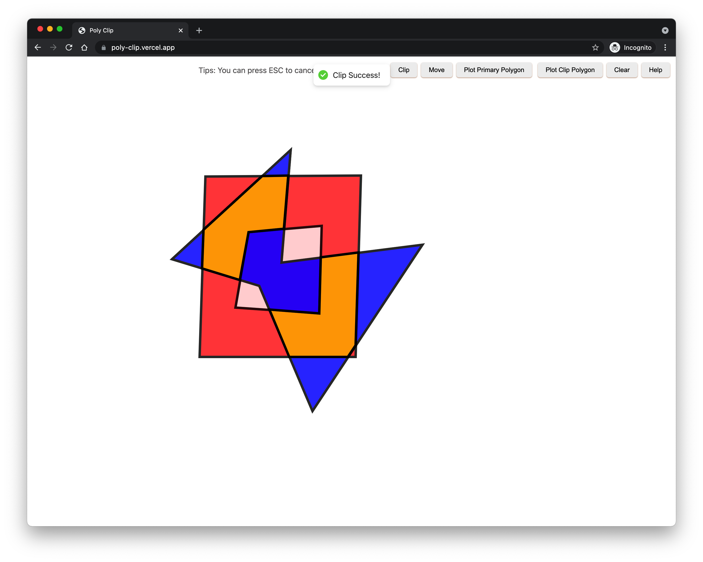
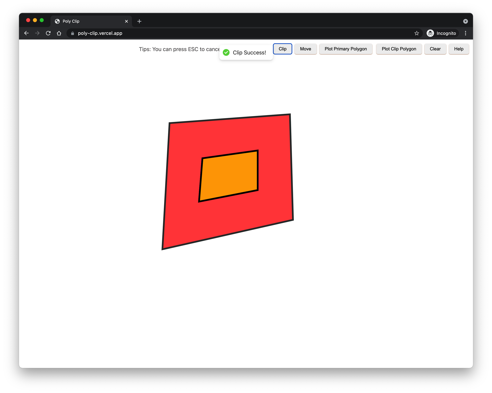

### 实验目的

完成由图形界面输入的裁剪多边形和主多边形间的裁剪，显示裁剪结果。


### 实验方法

使用Weiler-Atherton算法进行裁剪，首先利用叉积规范多边形顶点顺序，为外环顺时针，内环逆时针，接着对多边形进行求交点，并确定是入点还是出点，最后从入点进入，按照跟踪顺序得到裁剪后的所有多边形。


### 实验过程

#### 编译方式

###### 编译环境

使用rust实现裁剪算法编译到wasm，使用js实现UI界面，并调用编译到wasm的裁剪算法，得到结果后进行展示。

###### 生产环境

生产环境部署地址为https://poly-clip.vercel.app/，可直接访问使用。

###### 开发环境

```
# install rust
curl --proto '=https' --tlsv1.2 -sSf https://sh.rustup.rs | sh
rustup default nightly
rustup update

# install node
# see https://nodejs.org/en/download/

# install yarn
npm install -g yarn

# install wasm-pack to compile rust to wasm
curl https://rustwasm.github.io/wasm-pack/installer/init.sh -sSf | sh

# locate in project root folder
wasm-pack build
cd www
yarn
yarn start

# see http://localhost:8080/
```


### 交互方式

整体界面如图




点击`Help`按钮可查看使用帮助，在屏幕中任意点击左键可开始绘制多边形，闭合多边形时点击鼠标右键即可【注：此时同时会增加鼠标右键位置为多边形顶点】，在绘制过程中也可以使用ESC键取消当前绘制，绘制一个多边形外环后，后续继续绘制多边形会默认为多边形内环，点击`Plot Primary Polygon`可切换开始绘制主多边形【红色】，默认进入时即开始绘制主多边形，点击`Plot Clip Polygon`切换绘制裁剪多边形【蓝色】，点击`Clear`清除所有绘制，点击`Clip`可进行裁剪，裁剪结果多边形为橙色，点击`Move`，可以拖拽移动多边形，此时裁剪结果会随着多边形的移动实时更新。操作过程如下

<video src="assets/5.mov"></video>


### 实验结果

> 能正常裁剪除Weiler-Atherton算法不能处理的情况外的多边形测例

- 简单裁剪情况



- 带内环情况



- 包含情况



